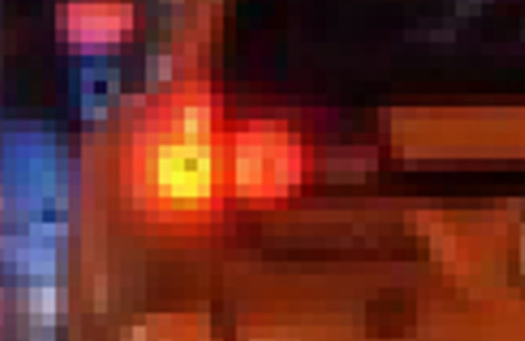
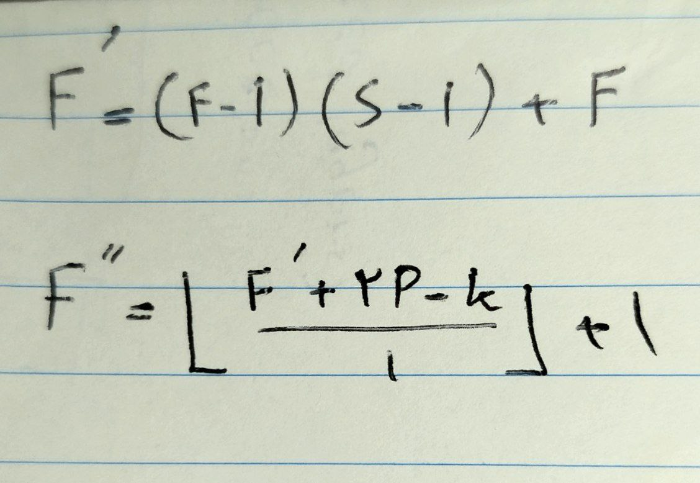

# DeConvolution

[](https://github.com/Ehsan-004/TinyUrler)
[](https://github.com/Ehsan-004/TinyUrler/blob/main/LICENSE)
[](https://github.com/Ehsan-004)
</br>

## A from-scratch implemention of some upsampling methodes such as DeConvolution and other methodes soon ...

</br>

applied a simple 3*3 kernel filled with ones:


main image:<br>


de-conved image:<br>


</br>


## 📝 Description

A from-scratch implemention of some upsampling methodes such as Transposed Convolution.<br>

</br>

Also see my Convolution Repo: [Ehsan-004/Convolution](https://github.com/Ehsan-004/Convolution)

</br>

New Length and Height of image after convolution come from this formula:


Actually first you should do zero-inserting by the number of ```S-1``` (Stride minus one). <br>
After that you do a simple convolution by stride of one ```s = 1``` <br>
To control the image size, you should mind the padding and kernel size and also stride.

## Note:
In neural networks and specially AutoEncoders, The benefit of DeConvolution than other upsampling methodes is that DeConvolution is learnable. In fact, weights of the kernel will be learnt by network as network keeps learning. <br>
Other methoedes are static and are not learnabel.


## 🧑‍💻 Developer

- [Ehsan-004](https://github.com/Ehsan-004)

## 📜 License

This project is open-source and does not have a specific license. Feel free to use, modify, and distribute it as you see fit.
